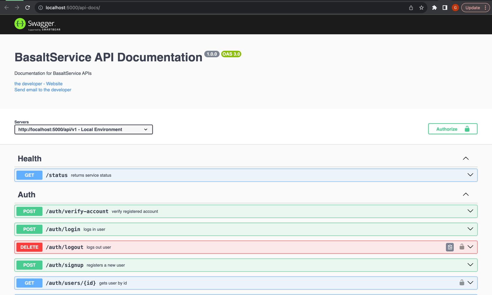

**BasaltService** is a microservice for user CRUD and country public holidays information built using NodeJs, ExpressJs, Typescript, Sequelize, MySQL, RabbitMQ, Redis

## How To Run Project

Clone the project
```bash
  git clone project
```

Navigate to the project directory
```bash
  cd project
```

Install dependencies
```bash
  npm install
```

Create build files
```bash
npm run build
```

Start the server
```bash
  npm run dev
``` 

## Create And Configure .env
Refer to the .sample.env on how to create a .env for the project and configure the database credentials based on the environment.

## How To Setup The Database
Create a new database if none exist based on the environment.
```bash
npm run migrate:db:create
```
Create the database tables by running the migration setup
```bash
npm run migrate:up
```
To rollback already ran migration, run
```bash
npm run migrate:undo
```
Seed records into the roles and users table by running
```bash
npm run db:seed
```
Rollback already ran seeders
```bash
npm run db:seed:undo
```

## Running Tests
To run tests, run the following command

```bash
  npm run test
```

## Documentation
[Postman Collection URL](): Import the collection in postman using the url shared via email

[Documentation](https://localhost:5000/api-docs): Navigate to ``https://localhost:5000/api-docs`` on your browser to view documentation



## Tech Stack
**Server:** Node, Express, Typescript

**Advanced Message Queue Protocol:** RabbitMQ

**Containerization:** Docker

**Caching:** Redis

**Database:** MySQL, Sequelize

## Author
[@gblend](https://www.github.com/gblend)

## 🔗 Links
[](https://gblend.tech/)
[](https://linkedin.com/in/gabriel-ilochi-75a237174/)